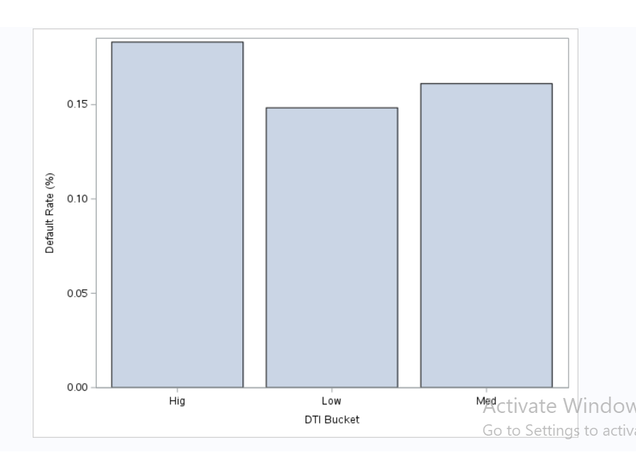
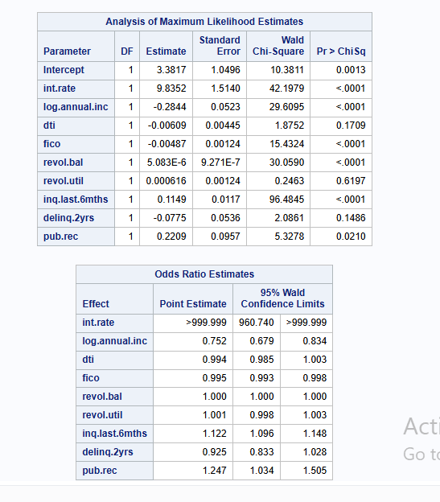

# Credit Risk Analysis Using SAS – Lending Club Loan Data

## Project Overview
This project analyzes borrower and loan characteristics to identify factors associated with loan default risk. Using public Lending Club loan data, the analysis applies statistical techniques and logistic regression modeling to support data-driven lending decisions.

## Business Objective
Financial institutions must manage credit risk to minimize loan losses while maintaining profitability. The objective of this analysis is to:
- Identify high-risk borrower segments
- Understand drivers of loan non-repayment
- Provide actionable insights for underwriting and risk management

## Dataset
Public Lending Club loan dataset containing borrower financial attributes, credit history, and loan performance outcomes.

**Target Variable**
- `not.fully.paid` (1 = loan not fully paid, 0 = fully paid)

## Tools & Technologies
- SAS Studio
- PROC SQL
- PROC MEANS
- PROC FREQ
- PROC LOGISTIC
- PROC SGPLOT

## Key Analysis Steps
1. Imported and cleaned loan data in SAS Studio
2. Created a default indicator (`default_flag`)
3. Performed exploratory data analysis on financial and credit variables
4. Conducted default rate analysis by credit policy and loan purpose
5. Built a logistic regression model to predict loan default
6. Visualized default trends using DTI risk buckets

## Key Insights
- Borrowers not meeting Lending Club credit policy exhibit significantly higher default rates
- Higher debt-to-income ratios are strongly associated with increased default risk
- Lower FICO scores and higher revolving credit utilization increase probability of non-repayment

## Business Recommendations
- Strengthen underwriting requirements for high-DTI borrowers
- Apply risk-based pricing strategies for lower credit profiles
- Implement early monitoring for borrowers exhibiting high-risk indicators

## Sample Outputs

### Default Rate by Credit Policy
outputs/DEFAULT ANALYSIS BY CREDIT POLICY.png

### Default Rate by DTI Bucket

### Logistic Regression Results

## Author
**Yvonne Twi-Yeboah**  
MSc Business Analytics & Information Management  
University of Delaware
